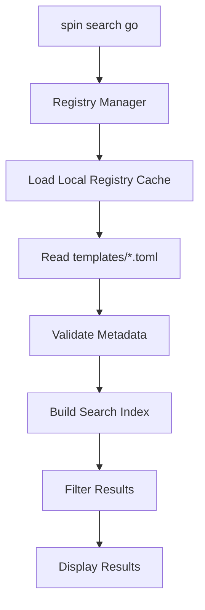
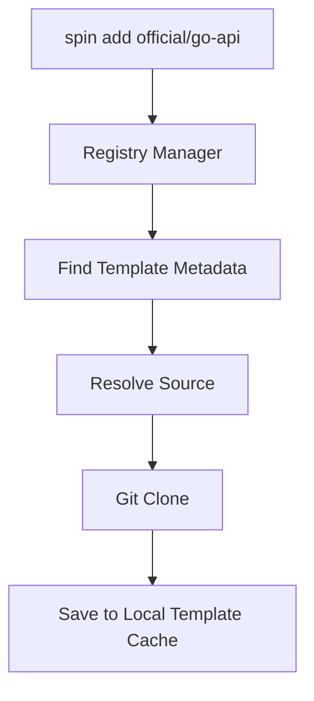
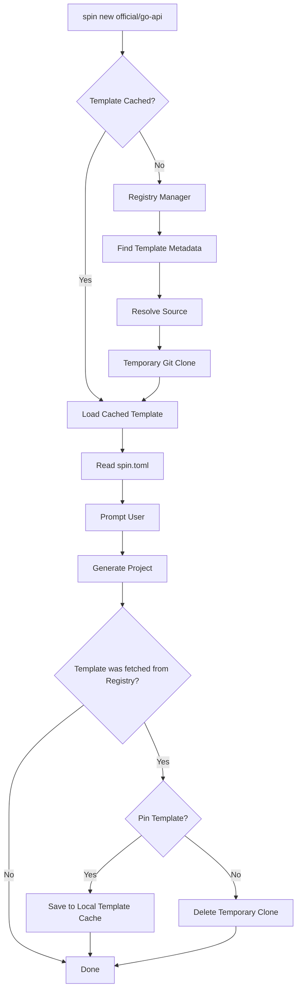
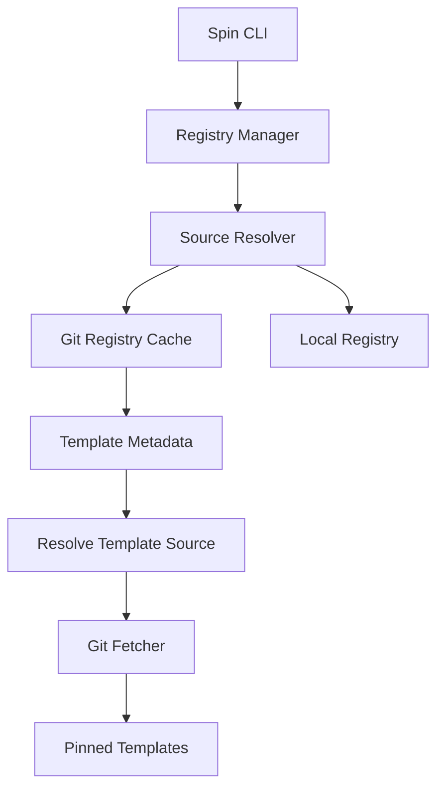

# Spin Registry V1 — Git and Local Based Registry

## Goal

Create a simple, decentralized registry system with **zero backend**.

The registry is just a Git repository or local path containing metadata.

Registries are cloned locally and searched from the local cache.

Templates remain in their original repositories.

The Source Resolver automatically detects whether a registry source is a local path or a Git repository.

---

## User Perspective

### Add a registry

```bash
spin registry add official https://github.com/example/registry
```
OR:
```bash
spin registry add local ~/local/path
```
### Update registries

```bash
spin registry update
```

### Search

```bash
spin search go
```

### Install (Pin)

```bash
spin add official/go-api
```

### Scaffold

```bash
spin new official/go-api
```

### List installed (pinned) templates

```bash
spin list
```

---

## Registry Layout

A registry must follow this directory layout to be considered valid.

Every registry must define required metadata and follow the validation and naming rules described in the Registry Specification.

```
registry/
├── registry.toml
└── templates/
    ├── go-api.toml
    ├── rust-cli.toml
    └── ...
```

Example `*.toml`

```toml
id = "go-api"
name = "Go API"
description = "Go REST starter"

# `source` is any Git/local source supported by the Source Resolver.
source = "https://github.com/spin-templates/go-api"

tags = [
    "go",
    "api"
]

# optional
authors = []
license = ""
homepage = ""
```

The `id` must match the file basename (without `.toml`). A file named `templates/go-api.toml` must have `id = "go-api"`; `id = "spin/go-api"` would be rejected because it does not match `go-api`.

Example `registry.toml`

```toml
id = "official"
name = "Official Spin Registry"
description = "Official templates maintained by the Spin team."
homepage = "https://spin.dev"
maintainer = "Spin Team"
license = "MIT"
```

---

## Registry Validation

A registry is considered valid when:

### Registry

- `registry.toml` exists.
- `templates/` directory exists.
- Required registry metadata fields are present.
- The registry layout follows the Registry Specification.

### Template Metadata

Each metadata file inside `templates/` must:

- Be a valid TOML document.
- Contain the required registry metadata fields.
- Have a unique `id` within the registry.
- Reference a valid source supported by the Source Resolver.

Invalid template metadata files are ignored and skipped; they do not appear in `spin search` results. Use `spin registry list` to see the registered registry aliases and `spin registry update <alias>` to refresh a git registry's cache.

---

## Search Flow



---

## Install Flow (Pinning a Template)



---

## Scaffold Flow



---

## Architecture



---

## New Commands (Registry)

- `spin registry`
  - add
  - list
  - update
  - remove

---

## Command Examples

```bash
# Add a registry

spin registry add <alias> <source>

# Examples

spin registry add official https://github.com/spin-org/registry

spin registry add community git@github.com:community/registry.git

spin registry add company ~/company-registry

spin registry add local ../registry

spin registry add backup file:///opt/spin/registry

# Note:
# The value after `add` is the local alias.
# It is NOT the registry id.

# List registries

spin registry list

# Update all registries

spin registry update

# Update a specific registry

spin registry update official

spin registry update company

# Remove a registry

# Note:
# Removal uses the alias, not the registry id.

spin registry remove official

spin registry remove company

spin registry remove local
```

---

Only valid template metadata files are indexed and searchable. Invalid files are silently skipped.

---

## Storage Location

```text
Local Storage

Registries
~/.config/spin/registries/

Pinned Templates
~/.config/spin/templates/
```

---

## Responsibilities

### Registry

- Search
- Metadata
- Source resolution

### Git

- Store templates
- Version history
- Updates

### Spin

- Registry management
- Installation
- Scaffold
- Search
- Updates
